# Code

Information about the code structure of dicomtrolley. Meant for developers seeking to 
[contribute](contributing.md) to the project. For quick examples see [usage](usage.md).
For a more high-level overview of dicomtrolley concepts see [concepts](concepts.md).

## Code documentation  
You can find documentation and code for all python classes in the [API reference](reference/SUMMARY.md)

## Class structure
Python class relations for some core dicomtrolley classes.

